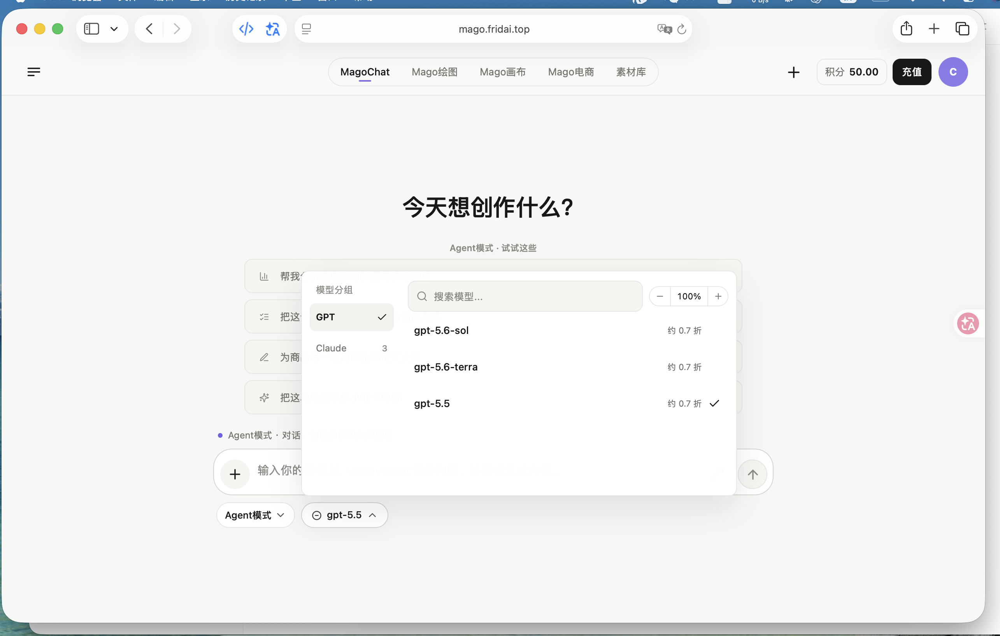
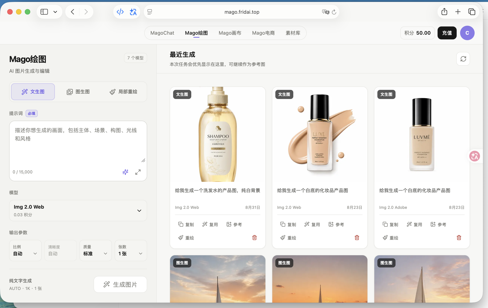
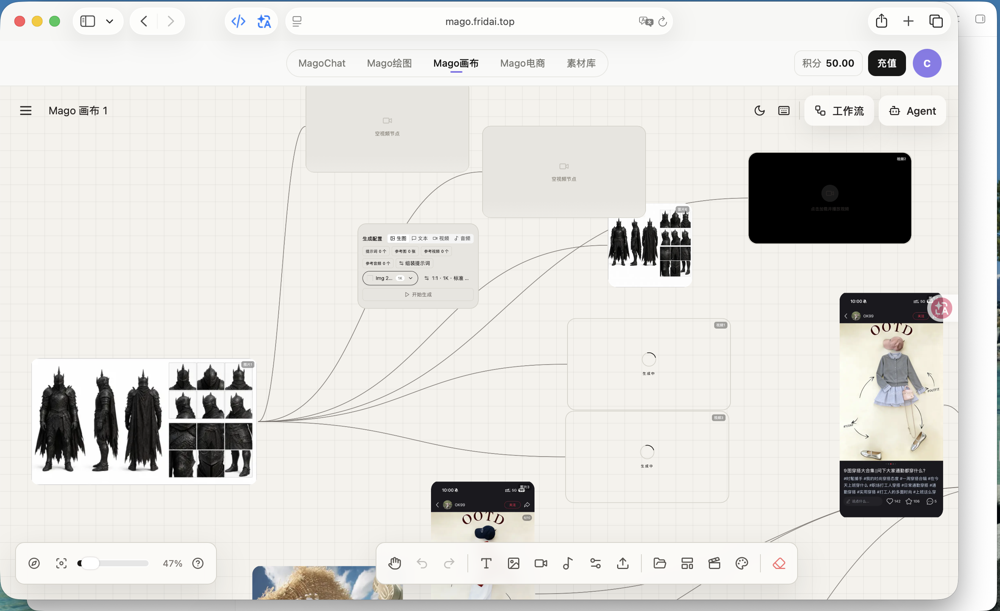
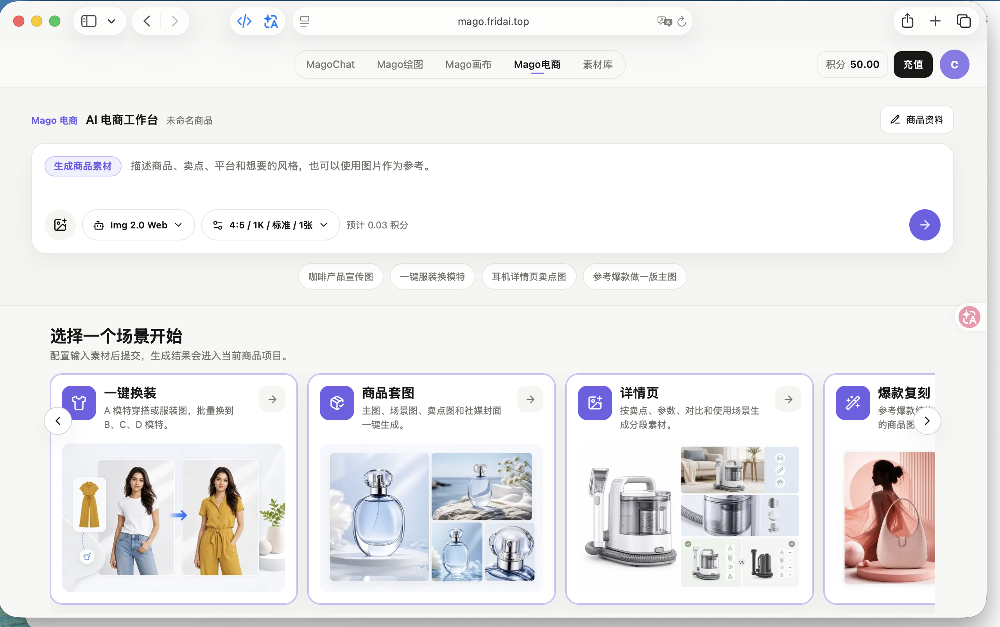
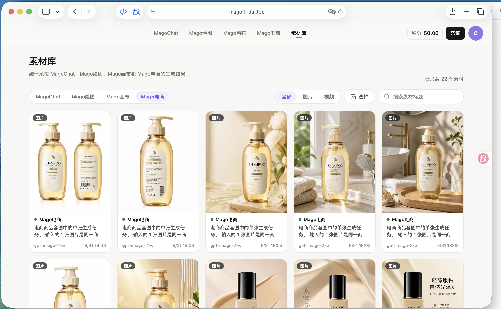
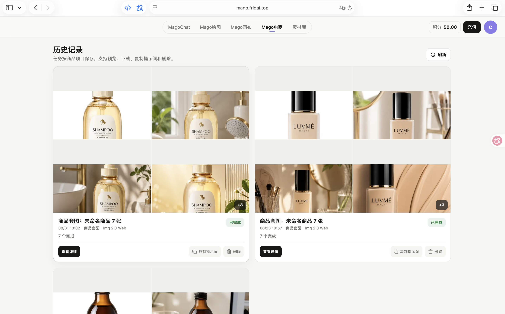

<div align="center">

# 🧙 Mago — 聚合型AIGC生图/生视频与企业内容生产引擎
### 企业级高可用 · 三层成本优化体系 · 垂类场景工业化能力 · 小团队做出大平台级SLA的盈利性AIGC项目
<p>
  
  
  30">
  
  
  
</p>

**👤 产品负责人：王泽栋**（主导需求挖掘、架构决策、商业化落地与跨团队协同，核心研发团队均有5年以上一线互联网分布式/云原生研发经验）  
📧 联系邮箱：3036272258@qq.com  
🌐 生产环境：[https://mago.fridai.top/](https://mago.fridai.top/) · 💳 [企业服务入口](https://mago.fridai.top/recharge)
</div>

---

## 🎯 一句话定位
在大厂纷纷下场、90% AIGC应用创业公司靠烧钱无法盈利的行业背景下，我们作为不到10人的精干团队，通过技术优化和场景深耕，用6个月时间跑通**正向盈利模型**：做到99.9%企业级可用性、单位算力成本比官方直连低40%、付费企业月复购75%+、LTV/CAC>30（远高于SaaS行业3的合格线），客户平均回本周期仅27天，验证了中小团队在AIGC应用层不靠烧钱也能健康盈利的可行路径。

---

## 📊 核心生产级指标（全量真实运营数据）
### 商业指标（UE模型健康度行业领先）
| 维度 | 数值 | 行业对比 |
| :--- | :--- | :--- |
| 业务规模 | 峰值日生成20万+张，日均稳定8-12万张 | 同规模团队中Top水平 |
| 转化效率 | 认证企业首充转化率85%+ | ToB SaaS行业平均30%-50% |
| 用户留存 | 付费企业月复购率75%+ | 中小企业SaaS平均复购约50% |
| 盈利情况 | 综合毛利率25%-30%，连续6个月正向盈利 | 90%以上AIGC应用仍处于亏损烧钱阶段 |
| 获客效率 | 企业客户平均获客成本<200元，LTV/CAC>30 | SaaS行业平均LTV/CAC=3为合格线 |
| 回本周期 | 单客户平均回本周期27天 | SaaS行业平均回本周期6-12个月 |
| 客户结构 | 核心十余家头部客户贡献约75%营收，腰部+个人客户贡献剩余25%，结构健康 | - |

### 技术SLA指标（达到企业级服务标准）
| 维度 | 数值 | 行业基线 |
| :--- | :--- | :--- |
| 平台年可用性 | 99.9% | 中小AIGC平台平均95% |
| 上游API故障自动切流时间 | <30s | 行业平均人工切换需数十分钟 |
| 端到端生成成功率 | 99.2% | 行业平均90%-95% |
| 新模型接入周期 | <4小时 | 行业平均2-3天 |
| 智能缓存命中率 | 12%+ | 多数中小平台未做缓存优化 |
| 单张生图P95响应时间 | <2.2s | 行业平均3-5s |

---

## 🔑 核心能力壁垒：技术+场景双轮驱动
我们不做"自研大模型"这类故事型投入，所有能力都围绕"帮客户以最低成本、最稳定的方式，拿到可直接商用的AIGC内容"这个核心价值，通过三层能力构建别人抄不走的竞争力：
### 1. 三层算力成本优化体系（单位成本比官方低40%的核心原因）
不是简单的找低价渠道赚差价，而是通过三层技术优化系统性降低成本：
- **第一层：上游多渠道动态竞价调度**：每个核心模型接入3家以上不同的API渠道，自研动态加权路由系统，实时根据渠道可用性、延迟、价格三维度自动分配流量，永远在保障SLA的前提下选择当前性价比最高的渠道，单这一层降低成本20%
- **第二层：智能请求批处理与缓存**：对同模型、同时间段的零散请求自动合并批处理，拿到上游批量折扣；对高频通用请求做二级缓存，相同请求直接返回结果，缓存命中率稳定12%以上，再降成本15%
- **第三层：弹性错峰调度**：非实时批量任务自动调度到非高峰时段、闲置低价资源池执行，不占用高峰高价配额，进一步降本5%
- 三层优化叠加，在保障99.9%可用性的前提下，做到单位算力成本比官方直连低40%，比大多数同行低20%以上，形成明显的价格优势。

### 2. 工业化垂类场景能力（比通用平台好用3倍）
不做所有人都能用的大而全工具，聚焦电商场景做工业化深度优化：
- 9类电商商用场景封装：一键换装、套图、详情页、爆款复刻、精修、白底图等，所有Prompt经过上百次迭代调优，内置商用负向词库，用户不需要懂Prompt工程，输入商品信息即可一键生成符合平台规范的商用图
- 建立双周迭代的Prompt工业化SOP：版本化台账、固定测试集双盲评估、灰度放量，电商场景首次出图商用符合率从38%提升到87%，用户平均重绘次数从2.7次降到1.1次，帮客户把做图效率提升3倍以上。

### 3. 企业级稳定性保障体系
针对企业批量生产场景设计五级纵深容错熔断机制，多渠道冗余容灾，故障自动切流，做到99.9%可用性，高峰时段不卡顿、不丢任务、不雪崩，稳定性远超个人中转站，和大厂服务SLA持平，但价格更低、响应更快。
> 新模型快速接入能力：自研轻量级多模型适配层，新模型发布后最快4小时即可完成接入上线，比同行快24小时以上，用户可以第一时间用到最新最强的模型能力。

---

## 🏗️ 云原生技术架构（务实不炫技，ROI优先）
遵循"简单够用、逐步演进"的架构原则，不做过度设计，用最少的资源支撑最高的稳定性：
```mermaid
graph TD
    subgraph 接入层
        A1[Web/OpenAPI] --> LB[多可用区负载均衡/限流熔断/WAF]
        LB --> Auth[鉴权/配额/预扣费]
    end
    subgraph 应用层（K8s弹性伸缩）
        Auth --> B1[对话服务/生图服务/电商模板引擎]
        Auth --> B2[DAG工作流编排引擎/全局特征一致性]
        Auth --> B3[素材库/计费/租户管理]
    end
    subgraph 核心调度层（自研）
        B1 & B2 --> Router[动态加权多模型路由器]
        Router --> Batching[智能批处理/多级缓存]
        Router --> Queue[优先级租户队列/错峰调度]
        Router --> Circuit[自适应熔断/自动切流]
    end
    subgraph 可观测层
        All[全链路] --> Log[OpenTelemetry全链路追踪]
        Log --> Metric[实时指标/成本看板]
        Log --> Alert[阈值告警/oncall机制]
    end
    subgraph 上游多活集群
        Circuit --> C1[主渠道集群]
        Circuit --> C2[备用渠道集群1]
        Circuit --> C3[备用渠道集群2]
    end
```
> 所有核心组件全部自研，技术栈统一为Go+React，没有异构技术栈的维护负担，新功能迭代速度是开源二次开发方案的3倍。

---

## 🚩 核心技术难点攻坚（主导跨团队解决）
### 难点1：高并发下的API雪崩防护
- 问题：上线初期高峰时段突发流量+重试风暴导致上游API被打满，最高失败率17%
- 解决方案：设计分层令牌桶限流+指数退避抖动重试+自适应熔断+优先级队列组合方案，企业用户请求优先，重试流量加随机抖动避免风暴，故障渠道自动熔断切流
- 效果：端到端成功率从91%提升到99.2%，彻底解决高峰雪崩问题，核心付费用户请求成功率100%
### 难点2：多图生成的人物/风格一致性
- 问题：漫剧/套图场景多节点生成的人物特征不一致，用户反复重绘
- 解决方案：设计全局特征注入+参考图强绑定+种子一致性锁定三层方案，工作流层面自动传递人物特征向量，无需用户手动调整
- 效果：多图一致性符合率从32%提升到78%，漫剧客户批量生产效率提升400%
### 难点3：实时成本与毛利管控
- 问题：上游API价格动态波动，事后对账发现不及时会导致亏损
- 解决方案：实现请求级实时成本核算，每笔请求路由前自动校验毛利阈值，小时级聚合毛利数据，异常立即告警
- 效果：成本异常1分钟内发现，无效浪费减少15%，连续6个月毛利率稳定在25%以上

---

## 📈 从0到1增长路径
1.  **冷启动（0-100用户）**：靠AIGC创作者圈层的朋友口碑启动，第一批种子用户全部来自熟人推荐和圈层传播，靠"便宜、稳定、好用"积累第一批核心付费用户
2.  **PMF验证（100-1000用户）**：通过用户访谈发现80%付费用户是电商从业者，果断砍掉通用C端非核心功能，all in电商场景优化，上线电商模块后第二个月企业付费率从40%提升到65%，复购率翻倍
3.  **自然增长（1000+用户）**：电商客户圈子集中度高，靠产品体验自然转介绍，转介绍率超过30%，几乎零获客成本，客户LTV/CAC高达30以上
4.  **未来规划**：
    -  纵向深耕：做电商全链路内容生产闭环，从图片到视频、从生成到管理覆盖完整电商内容流程
    -  横向拓展：持续优化DAG工作流能力，拓展漫剧制作团队客户，开辟第二增长曲线
    -  结构优化：逐步拓展腰部客户群，降低头部客户集中度，增强抗风险能力

---

## 🧠 产品方法论沉淀
做这个项目最大的收获不是赚了多少钱，而是验证了几个非常朴素的产品道理：
1.  **AIGC应用层的壁垒永远不是模型**：模型会越来越便宜、越来越强，所有团队最终拿到的模型能力都会趋同，真正的壁垒是成本管控能力、稳定性、场景know-how、客户响应速度，这些是大厂做不好、抄不走的
2.  **ToB产品的本质是帮客户算账**：客户不为"技术先进""模型自研"付费，只为"帮我省多少钱、赚多少钱、省多少时间"付费，把客户的ROI算清楚，比什么功能都管用
3.  **小团队不要追求大而全**：资源有限的时候，把一个核心场景打穿做透，比做10个不痛不痒的功能强100倍，找到付费意愿最强的那群人，把他们的需求做到极致，自然能活下来
4.  **技术永远服务于商业**：不做炫技式的过度设计，所有技术投入都算ROI，能提升稳定性、降低成本、提升客户体验的技术才值得做，为了技术而技术是自嗨。
> 所有踩坑复盘和决策过程见：[从0到1踩坑记录与经验沉淀](./docs/retrospective/01-pitfalls-and-lessons.md)

---

## 📚 全量文档索引
| 分类 | 文档 | 核心内容 |
| :--- | :--- | :--- |
| 调研 | [157份用户调研摘要](./docs/01-user-research-summary.md) | 用户画像、痛点排序、需求优先级决策 |
| 流程规范 | [Prompt工业化迭代SOP](./docs/02-prompt-iteration-sop.md) | 版本化管理、双盲测试、灰度放量全流程 |
| 技术设计 | [五级容错熔断架构设计](./docs/03-error-handling-mechanism.md) | 全链路稳定性保障、故障处理SOP |
| 商业体系 | [定价与毛利管控机制](./docs/04-pricing-and-margin.md) | 成本结构、定价模型、实时成本核算 |
| 决策记录 | [5篇核心架构/战略ADR](./docs/adr) | 每一个重大技术/商业决策的方案对比、权衡依据、落地效果 |
| 复盘沉淀 | [从0到1踩坑复盘](./docs/retrospective/01-pitfalls-and-lessons.md) | 做项目过程中踩过的4个核心大坑、根因分析、经验教训 |

---

## 🖼️ 产品界面
| 模块 | 生产截图 |
| :--- | :--- |
| MagoChat 多模型选择 |  |
| Mago绘图操作台 |  |
| Mago画布工作流 |  |
| Mago电商工作台 |  |
| 统一素材库 |  |
| 任务管理 |  |

---

## 💬 交流沟通
- 欢迎访问[生产环境](https://mago.fridai.top/)体验，新用户赠送50积分测试基础功能
- Bug、功能建议欢迎通过Issue提交
- **求职说明**：我目前正在寻求AI产品经理/ToB SaaS产品经理方向的校招/实习机会，有完整的从0到1落地AI产品、跨团队协同、跑通商业闭环的实战经验，具备技术理解力、商业算账能力和落地执行力，欢迎HR和业务负责人联系沟通。

---

## 📄 版权声明
1.  本仓库公开的产品思路、架构设计、复盘内容采用MIT协议授权，引用请保留版权声明
2.  Mago为正式商业化运营平台，核心代码、调度算法、商业资源为团队所有，暂不开源
3.  用户生成内容版权归用户所有
