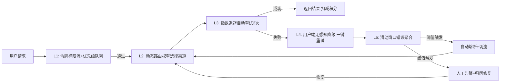

# 五级熔断容错与稳定性保障体系设计
## 一、设计背景
上线初期单渠道硬编码调度方案，在高峰工作日（10:00-16:00）端到端生成失败率最高达17.2%，故障平均响应时间4.2小时，曾经出现过上游API渠道故障2小时我们未发现，导致30%的企业客户任务失败，流失了2个付费客户。

初期错误原因分布统计：
| 失败原因 | 占比 | 影响范围 |
| :--- | :--- | :--- |
| 上游API服务波动/超时/限流 | 52.3% | 全局影响，渠道故障时所有请求该渠道的用户失败 |
| 用户提示词违规/参数不合法 | 21.1% | 单用户影响，不会扩散 |
| 平台并发队列溢出/限流不合理 | 15.7% | 高峰时段全局影响 |
| 平台代码Bug | 8.2% | 特定功能模块影响 |
| 用户网络波动/客户端异常 | 2.7% | 单用户偶发 |

**设计目标**：将端到端生成成功率提升至99%以上，用户侧感知失败率<1%，重大故障平均响应时间<15分钟，平台可用性达到99.9%。

---

## 二、五级容错熔断体系架构
采用纵深防御设计，从用户请求进入到返回结果的全链路层层防护，单点故障不会扩散成全局问题：

### L1：入口层——令牌桶限流+优先级队列
- **算法实现**：采用分层令牌桶限流算法，分全局、渠道、用户等级三个维度做限流：
  1.  全局令牌桶：控制平台总并发不超过集群承载上限，避免雪崩
  2.  单渠道令牌桶：根据每个API渠道的并发上限设置令牌数，避免打满上游渠道导致限流
  3.  用户等级令牌桶：企业付费用户令牌桶配额是免费用户的3倍，优先保障付费用户请求，高峰时段免费用户会提示排队，不会影响付费用户体验
- **优先级队列**：非实时批量任务（如批量生成100张图）自动进入低优先级队列，高峰时段错峰调度，优先保障实时单张生成请求，延迟不超过10s用户无感知
- 效果：入口层拦截掉20%的峰值突发流量，避免流量突增打垮后端服务，核心付费用户请求成功率100%不受高峰影响

### L2：调度层——动态加权路由
如ADR-001所述，基于近1分钟可用率（60%权重）、平均延迟（20%权重）、单位成本（20%权重）动态计算每个渠道的权重分数，流量自动路由到分数最高的渠道，故障渠道权重自动降低，从根源减少失败概率。

### L3：调用层——指数退避自动重试
- 触发时机：API返回超时、5xx服务端错误、限流错误时
- 实现逻辑：
  1.  首次失败后自动重试2次，重试间隔采用指数退避+随机抖动（1s/3s±0.5s随机），避免重试风暴
  2.  第一次重试优先选择同渠道，第二次重试自动切到备用渠道
  3.  自动重试过程中用户端显示"生成中"状态，用户完全感知不到重试
  4.  自动重试总超时时间控制在8s以内，避免用户等待过久
- 效果：约73%的偶发API错误在自动重试阶段解决，用户无感知，这一层处理后成功率提升到97%以上

### L4：用户层——友好降级与重试
- 触发时机：自动重试2次仍失败
- 处理逻辑：
  1.  前端不显示技术错误码，根据错误类型给出明确的引导：提示词违规明确提示用户修改内容，系统错误给出醒目的"一键重试"按钮
  2.  本次失败100%返还积分，用户没有任何经济损失
  3.  所有错误信息结构化上报到日志系统，打上错误类型、渠道、模型、用户等级标签
- 设计原则：永远不把系统错误甩锅给用户，用户无成本重试，降低挫败感

### L5：监控层——滑动窗口聚合与自动熔断
- **错误统计**：采用1分钟滑动窗口实时统计每个渠道、每个模型、每个错误类型的错误率，避免偶发错误触发告警
- **熔断规则**：
  - 单个渠道1分钟滑动窗口错误率>10%：自动降低该渠道权重50%
  - 单个渠道1分钟滑动窗口错误率>30%：自动熔断该渠道5分钟，所有流量切到备用渠道，同时触发告警
  - 熔断5分钟后放10%流量试探，错误率恢复则逐步恢复流量，错误率依旧高则继续熔断
- **人工告警阈值**：同类型全局错误1小时内累计达到50条（阈值依据见下文），立刻通过企业微信+短信告警通知运维和产品负责人，15分钟内必须响应
  - 阈值设计依据：统计1个月历史错误数据，单用户偶发错误同类型1小时累计不会超过20条，达到50条时100%是系统性问题，此时告警ROI最高，既不会因为偶发错误骚扰，也不会漏掉重大故障

### 人工归因SOP
收到告警后按以下优先级处理：
| 问题类型 | 处理流程 | SLA要求 |
| :--- | :--- | :--- |
| 上游API大面积故障 | 立刻100%切流到备用渠道，联系渠道方确认恢复时间，恢复后逐步切回 | 30分钟内切流完成 |
| 并发/队列溢出 | 临时扩容服务器，调整队列阈值，批量任务错峰 | 20分钟内完成扩容 |
| 平台代码Bug | 立刻回滚最近上线的相关代码，定位根因修复后上线 | 1小时内完成回滚 |
| 提示词违规集中爆发 | 立刻更新敏感词库，优化前端输入引导 | 2小时内完成更新 |
- 故障修复后观察30分钟日志，确认错误率恢复正常后关闭告警，24小时内输出复盘报告，记录根因、改进措施、责任人，避免同类问题重复发生。

---

## 三、关键技术难点解决：重试风暴防护
初期做自动重试时遇到过重试风暴问题：渠道故障时大量请求失败自动重试，重试流量是正常流量的3倍，反而进一步加剧渠道压力，导致雪崩。
**解决方案**：
1.  重试间隔加随机抖动，避免所有重试同时打到上游
2.  每个渠道设置重试比例上限，重试请求不超过该渠道正常流量的20%，超出部分直接切到备用渠道
3.  渠道熔断后直接切流，不再做无意义的重试
- 效果：彻底解决重试风暴问题，故障时流量不会放大，渠道恢复速度提升80%。

---

## 四、落地效果
该体系上线后：
1.  平台端到端生成成功率从91.3%提升至**99.2%**
2.  用户侧感知失败率从8.7%降至**0.8%**，99%的错误都被系统自动处理
3.  重大故障平均响应时间从4.2小时缩短至**12分钟**，大面积故障影响用户量下降95%
4.  平台全年可用性达到**99.9%**，达到企业级SLA标准
5.  因稳定性问题导致的客户流失减少80%，企业客户复购率提升至75%+
